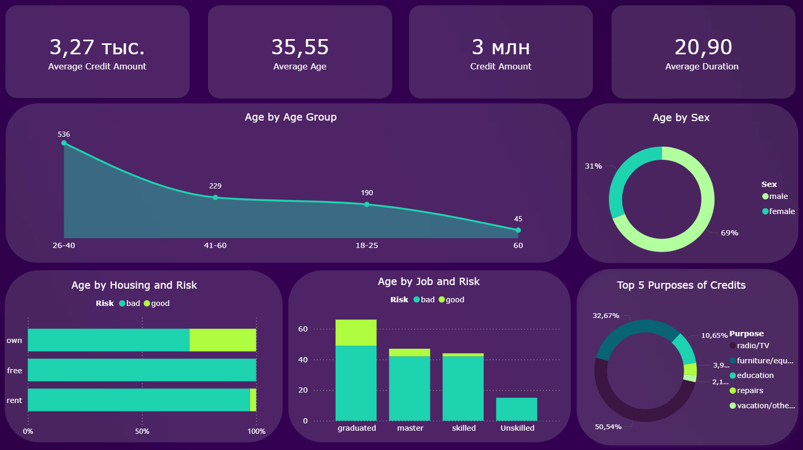
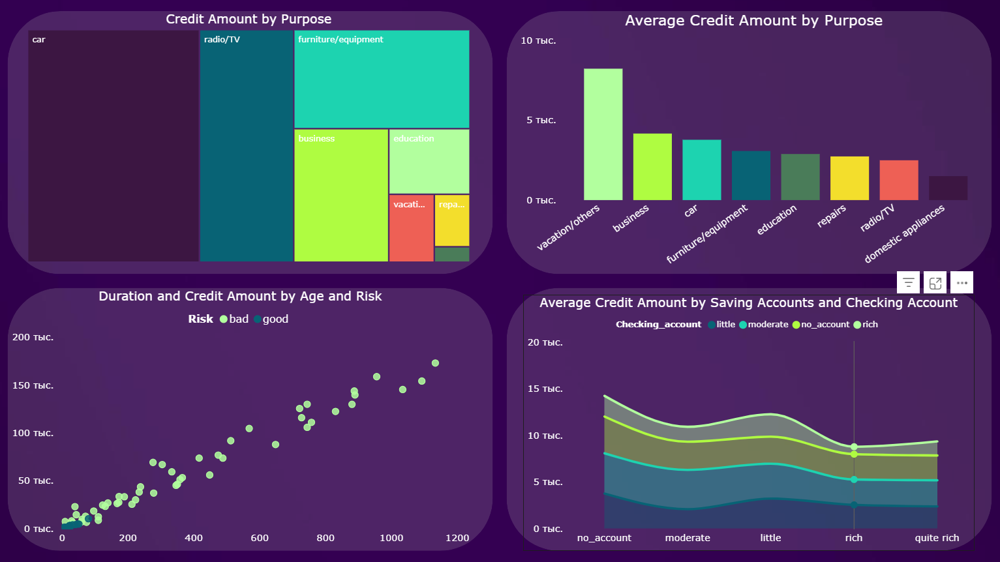

# Credit Risk Scoring Project

## Overview

This project focuses on predicting customer credit risk using machine learning and business intelligence tools.

The main objective is to help banks identify high-risk customers and improve loan approval decisions using data-driven analysis.

---

## Business Problem

Banks face significant financial losses when customers fail to repay loans.

This project aims to answer the following question:

> “Should the bank approve this customer's loan application?”

Using customer financial and demographic information, we analyze risk patterns and build a predictive model to identify risky customers.

---

## Dataset

The project uses the **German Credit Dataset**, which contains customer information such as:

* Age
* Job
* Housing status
* Saving accounts
* Checking accounts
* Credit amount
* Loan duration
* Loan purpose
* Risk category

---

## Data Cleaning

The following preprocessing steps were performed:

* Removed unnecessary index column
* Handled missing values
* Standardized column names
* Cleaned and transformed target variable (`Risk`)
* Prepared data for machine learning pipeline

---

## Exploratory Data Analysis (EDA)

EDA was conducted to identify patterns and relationships between customer attributes and credit risk.

### Key Insights

* Customers with longer loan durations tend to have higher risk levels
* Low savings are strongly associated with higher default risk
* Customers who rent homes show higher risk compared to homeowners
* Larger credit amounts increase financial risk exposure

---

## Feature Engineering

Several new features were created to improve model performance:

* `Loan_to_Age`
* `Monthly_Payment`
* `Has_Savings`
* `Has_Checking`
* `Housing_Status`

These features help better represent customer financial behavior and stability.

---

## Machine Learning Model

### Model Used

* Logistic Regression

### Workflow

* Data preprocessing
* Feature encoding
* Train-test split
* Model training
* Model evaluation

### Evaluation Metrics

* Precision
* Recall
* F1-score
* Confusion Matrix

---

## Key Findings

The analysis showed that:

* Long-term loans carry higher risk
* Customers with little or no savings are more likely to default
* High monthly payment obligations increase financial pressure
* Housing stability plays an important role in credit risk assessment

---

## Power BI Dashboard

An interactive Power BI dashboard was developed to visualize customer risk behavior and banking insights.

### Dashboard Features

* Risk distribution analysis
* Credit amount analysis
* Housing and savings insights
* Loan purpose analysis
* KPI cards for business metrics
* Interactive filters and slicers

### Dashboard Preview





## Business Impact

This project can help financial institutions:

* Reduce loan default risk
* Improve customer risk assessment
* Make data-driven lending decisions
* Better understand customer financial behavior

---

## Tech Stack

* Python 3.13
* pandas
* numpy
* matplotlib
* seaborn
* scikit-learn
* Power BI
* Git & GitHub

---

## Project Structure

```text
credit-risk-scoring/
│
├── data/
│   ├── german_credit_data.csv
│   │
│   └── processed/
│       ├── cleaned_data.csv
│       └── final_data.csv
│
├── notebooks/
│   ├── 01_eda.ipynb
│   └── 02_modeling.ipynb
│
├── dashboards/
│   ├── credit_risk_dashboard.pbix
│   ├── dashboard_main.png
│   └── risk_analysis.png
│
├── src/
│
├── README.md
└── .gitkeep
```

---

## Future Improvements

Potential future enhancements:

* Random Forest / XGBoost models
* Hyperparameter tuning
* Streamlit deployment
* Real-time prediction system
* Advanced feature engineering

---

## 👤 Authors

**Muhammad Sodiq**
**Jasur**

GitHub: https://github.com/ALPHAclose
GitHub: https://github.com/alphabeastclosef
